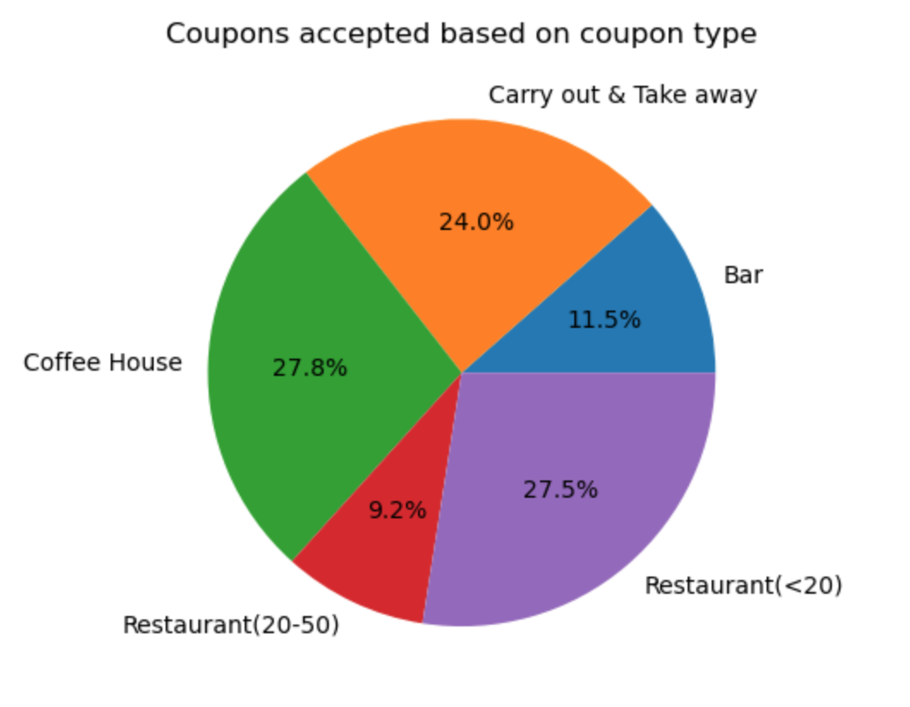
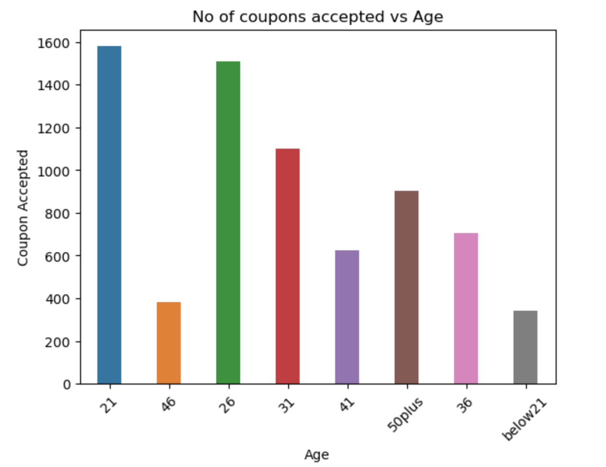
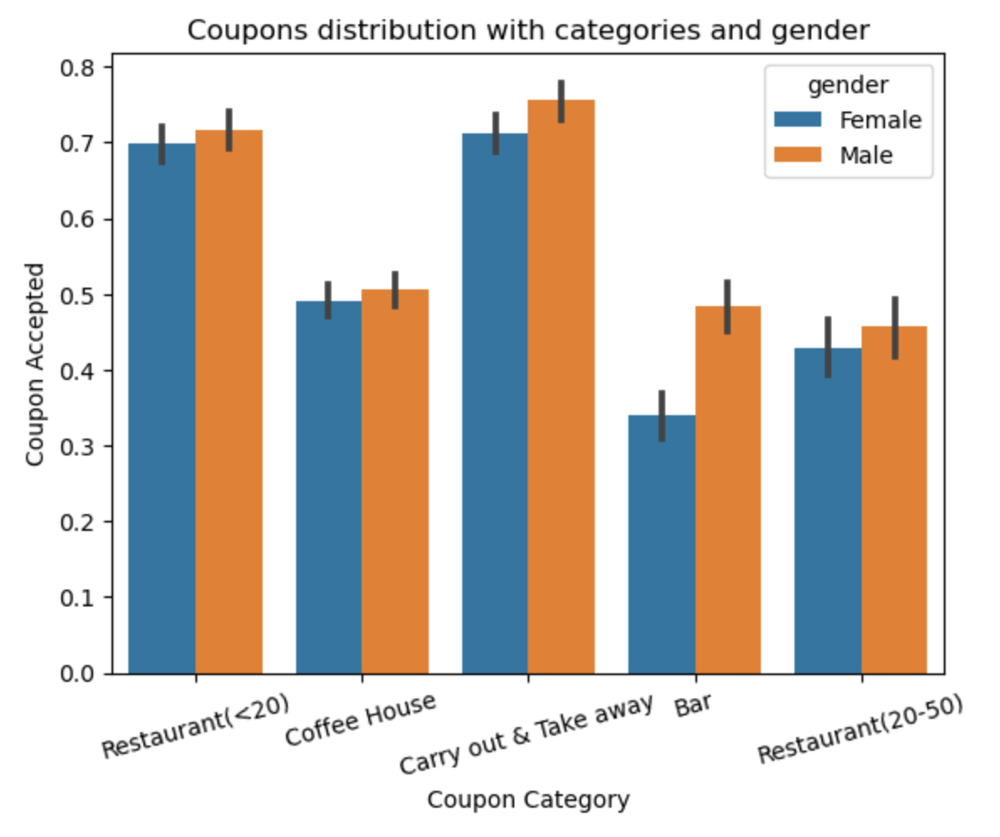
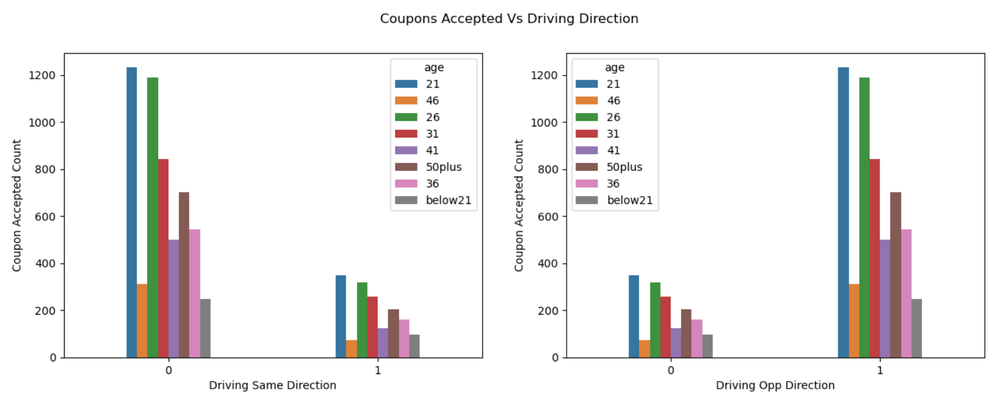

# Coupon Data Analysis

## Introduction
   This project contains data analysis using the dataset of [coupons](data/coupons.csv). The goal of this project is to identify the patterns in the data and predict or recommend future actions to improve the effectiveness of the coupons.

   Here is the dataset description - https://archive.ics.uci.edu/dataset/603/in+vehicle+coupon+recommendation

## Data Cleanup
   The coupons dataset is contains all raw data and needs some cleanup to do some analysis. I have used python [pandas](https://pandas.pydata.org) and [numpy](https://numpy.org) libraries to cleanup the data.

   Few points to note
   * Renamed column 'Y' to 'coupon_accepted' to clearly understand the dataset
   * Updated 'less1' values to 'never' as less than one visit or never both could be same
   * Other usual operations like, fillna, dropna, delete duplicates etc...

   Finally the cleaned up dataset is being saved into [coupons processed](data/coupons_processed.csv) as this processed dataset can be used for analysis and reused for any other purpose as well if needed.

## Visualizations
   Visualizations are there to help understand the data little easier than tabular data. To do these visualizations i have used [matplotlib](https://matplotlib.org) and [seaborn](https://seaborn.pydata.org).

   Few things to note:
   * Pie plots to understand the rate of coupons acceptance
   * Bar plots to know how a feature is with its values
   * Count Plots to know the categorical counts pattern

   Here are few examples of such visualizations
    
    
    
    
  
## Conclusion
   This project demonstrated usage of various python libraries to do data analysis and visualizations. There are some other libraries to consider as well, for example [plotly](https://plotly.com/python/) for great visualizations.